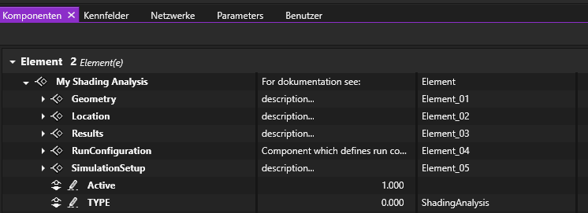
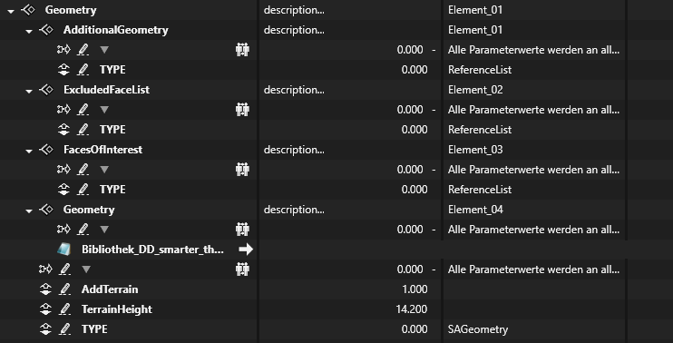
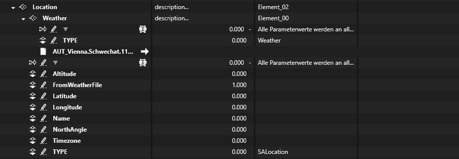
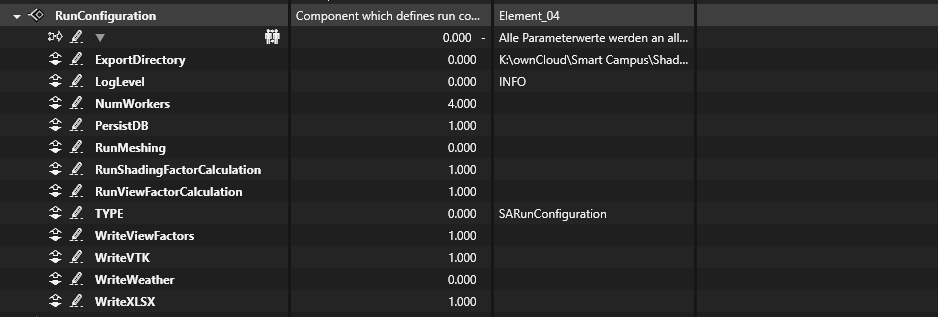
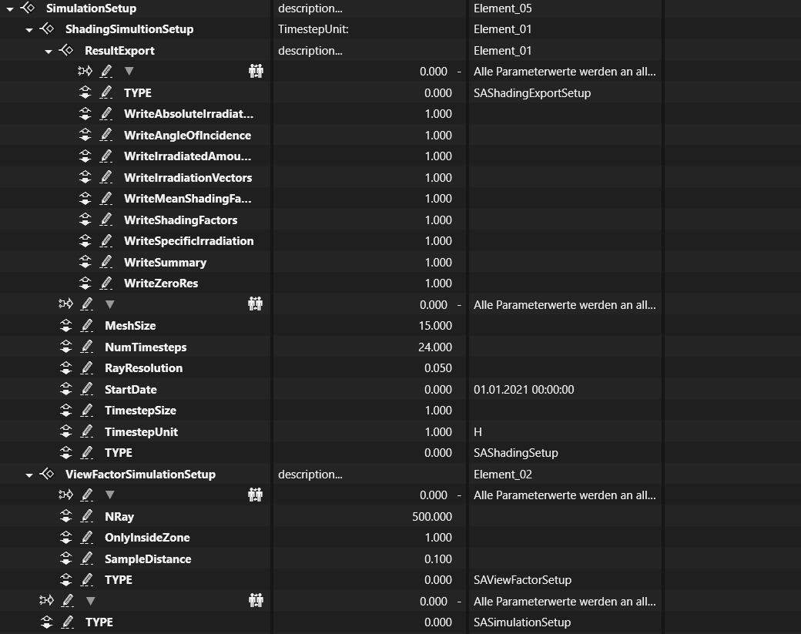

# PySimultanRadiation

Software to calculate solar irradiation for SIMULTAN-Projects

## Installation

### Windows

1. Install Docker-Desktop:  https://www.docker.com/products/docker-desktop
2. Download and install Python 3.8: https://www.python.org/ftp/python/3.8.10/python-3.8.10-amd64.exe
3. Install PySimultanRadiation: if Python 3.8 is your default version run: 
    ```cmd
    pip install PySimultanRadiation in cmd-window
    ```

### Ubuntu
1. Install Docker: see https://docs.docker.com/engine/install/
2. Install Python 3.8: <br />
    ```bash
    sudo apt update
    sudo apt install software-properties-common
    sudo add-apt-repository ppa:deadsnakes/ppa
    sudo apt install python3.8
    ```
3. Install PySimultanRadiation: <br />
`pip3 install PySimultanRadiation`


## Update
To update to the latest version run: `pip install PySimultanRadiation --upgrade`

# Usage

## Run a shading analysis

A shading analysis for PySimultanRadiation is defined by a `ShadingAnalysis` component in Simultan. To run a 
shading analysis create a `ShadingAnalysis`-component in your Simultan-project, save and close it. 

Download [run_shading_analysis.py](resources/run_shading_analysis.py) and adapt the username and password in 
lines 20 and 21 of the downloaded `run_shading_analysis.py` to the user and password  of your Simultan-project:

 ```python
 project_loader = ProjectLoader(project_filename=project_filename,
                                user_name='admin',
                                password='admin')
 ```

Run `run_shading_analysis.py` and select your Simultan-project in the filedialog: 

(Windows: To run the `run_shading_analysis.py` type `python run_shading_analysis.py` in a cmd-window and press enter.)

Depending on the settings, .vtk-Files and a xlsx file with the results is exported.

## ShadingAnalysis component

### Import via template

A Template for this component can be downloaded here: [ShadingAnalysis.zip](resources/ShadingAnalysis.zip) 
To import the template choose 'Bibliothek importieren' in Simultan and choose the `ShadingAnalysis.zip` file.

### Structure of the ShadingAnalysis component

A ShadingAnalysis has to have a certain structure to be able to import it in python. For more information see 
the documentation of [PySimultan](https://pypi.org/project/PySimultan/) 

Here is a ShadingAnalysis-component in Simultan:


In the component and all sub-components, there is a parameter `TYPE` defined, by which the component can be identified 
during import. These `TYPE`-parameters must not be changed. 

In the component are the following sub-components:

* Geometry: Defines the geometry for the simulation
* Location: Defines the location and the weather for the simulation
* Results: Component where the results are stored (not yet implemented)
* RunConfiguration: Defines general run options like result exports etc. 
* SimulationSetup: Defines options for the ShadingSimulation and the ViewFactorSimulation

**These sub-components have a certain slot, which must not be changed!**

### Geometry



The geometry-component defines the geometry for the simulation.

* Additional Geometry: Defines additional Geometry which can be added to the scene. 
This can also be geometry from .stl, .vtk, .step, .ifc files. **Implementation not finished! - keep empty** 


* ExcludedFaceList: Defines which faces should be excluded fom the scene in the simulation. Add references of faces to exclude.


* FacesOfInterest: Defines faces, for which results are exported in the xlsx-file. If empty (no references) results for
all faces are exported.


* Geometry: Component with a reference to the used .simgeo file. All the geometry in this file is used in the scene for 
the simulation


* AddTerrain: Defines if terrain is added to the scene. 1: Add terrain, 0: do not add terrain


* TerrainHeight: Height in [m] of the terrain.


### Location



The Location-component defines the location and the weather for the simulation.

* Weather: Reference to a *.epw file, which contains weather data. see also: https://www.ladybug.tools/epwmap/


* Altitude: Altitude in [m]


* FromWeatherFile: If 1, Altitude, Latitude, Longitude, Name and Timezone are taken from the *.epw file; if 0, values 
from the parameters are taken


* Latitude


* Longitude


* Name: Name of the location


* NorthAngle: Angle between the z-Axis and the north-direction in deg


* Timezone: Time shift to utc in [h]


### Results

Not implemented yet. Here are results from the simulations inserted


### RunConfiguration




* ExportDirectory: Directory where results are stored. Text-value. If directory does not exist, the directory is created.


* LogLevel: Level of the log; Text-value; Valid LogLevels: DEBUG, INFO, WARNING, ERROR


* NumWorkers: Number of worker to run the simulation; Value, integer; The more the faster :-)


* PersistDB: Keep database after run. <br />
If 0, the database is deleted after the run; if 1 the database is kept. <br />
If the database is kept, the mesh and results are stored and don't have to be recalculated.


* RunMeshing: If 0 run meshing; if 1 use mesh from db (if mesh exists, otherwise run meshing)


* RunShadingFactorCalculation: If 1 run ShadingFactor calculation, if 0 skip


* RunViewFactorCalculation: If 1 run ViewFactor calculation, if 0 skip


* WriteViewFactors: if 1 write view factors to xlsx


* WriteVTK: if 1 write vtk files


* WriteWeather: if 1 write weather data to xlsx


* WriteXLSX: if 1 write xlsx


### SimulationSetup



The SimulationSetup component has two subcomponents: `ShadingSimultionSetup` and `ViewFactorSimulationSetup`.
In `ShadingSimultionSetup` is the setup for the ShadingSimultion defined, in `ViewFactorSimulationSetup` the setup for the ViewFactorSimulation.

#### ShadingSimultionSetup

* MeshSize: mesh size in [m]. The mesh size is only relevant for the visualization and does not have a impact on
the results. If only results are required, set the mesh size to a large value like 99999


* NumTimesteps: Number of calculated timesteps


* RayResolution: distance between rays in [m]. The smaller the RayResolution the better art the results. 
RayResolution between 0.1 and 0.005 is recommended.


* StartDate: Date of the first calculated timestep; Text value; Format: dd.mm.yyyy HH:MM:SS


* TimestepSize: timestep size. Unit defined in TimestepUnit


* TimestepUnit: Unit of the timestep. Valid units are for example: H, min, S. 
See also https://pandas.pydata.org/pandas-docs/stable/user_guide/timeseries.html#offset-aliases


* WriteZeroRes: If 1 Write results where everything is zero (Sun below horizon).


#### ViewFactorSimulationSetup

* NRay: Number of rays shot from one sample point. The higher the number of rays, the better the result. Reasonable number
of rays is 100 ... 500 (depends also on the size of the faces and the SampleDistance)


* OnlyInsideZone: if 1 calculate only view factors for faces inside zones


* SampleDistance: Distance between sample points in [m]. Reasonable values are 0.1 ... 0.005


## Tips and Tricks

* There can be several ShadingAnalysis components in one projekt. <br />
If there are several ShadingAnalysis components, PySimultanRadiation runs one component after another if 
their Parameter `Active` is 1.


* ShadingAnalysis components can be everywhere in the component-tree. Although, it might make sense to 
create it on the top level.


* The names of the ShadingAnalysis component and the sub-components can be changed. But parameter-names and
slots must not be changed.


## Troubleshooting
